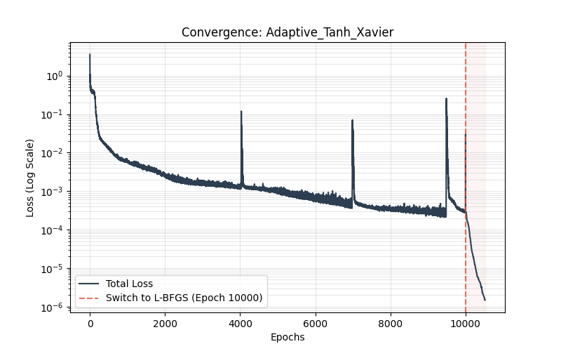
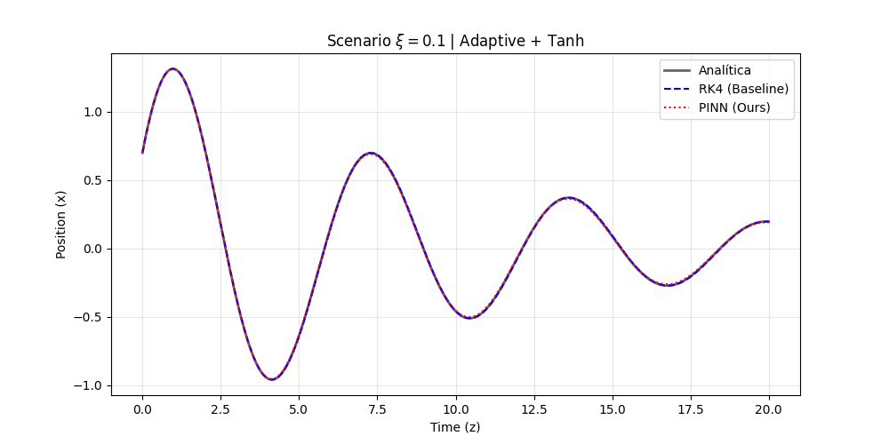
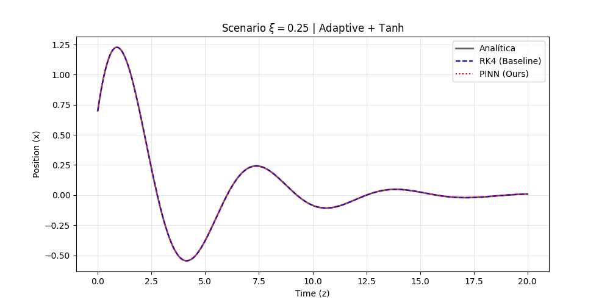
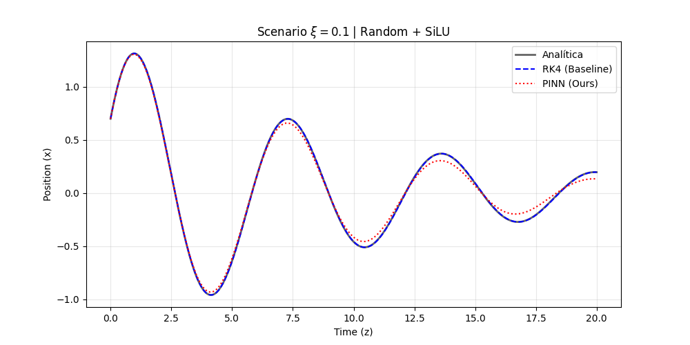

# DHO-PINN: Parametric Physics-Informed Neural Networks
> **Research and Implementation of Damped Harmonic Oscillators using PINNs for GSoC 2026 (ML4SCI).**

This repository provides a comprehensive benchmarking framework for solving the Damped Harmonic Oscillator (DHO) Ordinary Differential Equation (ODE) using Physics-Informed Neural Networks (PINNs). The model is parametrically conditioned on the damping ratio $\xi \in [0.1, 0.4]$ over an extended temporal domain $z \in [0, 20]$.

---

## Mathematical Formulation

### 1. The Governing Equation
The system models a **Damped Harmonic Oscillator (DHO)**, a fundamental second-order linear ordinary differential equation (ODE). The governing physics, conditioned on the damping ratio $\xi$, is defined as:

$$\frac{d^2x}{dz^2} + 2\xi\frac{dx}{dz} + x = 0$$

Given the initial conditions (ICs) for this benchmark:
* $x(0) = x_0 = 0.7$
* $\frac{dx}{dz}(0) = v_0 = 1.2$
* Domain: $z \in [0, 20]$
* Parameter range: $\xi \in [0.1, 0.4]$ (Underdamped regime)

### 2. Analytical Solution (Reference)
To evaluate the PINN's accuracy, we compare the predictions against the exact analytical solution for the underdamped case ($0 \le \xi < 1$):

$$x_{exact}(z) = e^{-\xi z} \left[ x_0 \cos(\omega_d z) + \frac{v_0 + \xi x_0}{\omega_d} \sin(\omega_d z) \right]$$

Where the damped natural frequency $\omega_d$ is defined as:
$$\omega_d = \sqrt{1 - \xi^2}$$

---

## Technical Architecture

The core implementation focuses on a **Parametric PINN** architecture optimized for long-term numerical stability and gradient flow efficiency.

### 1. Hard Constraints (Exponential Ansatz)
Instead of penalizing initial conditions (ICs) within the loss function (Soft-PINN), this project utilizes an **Exponential Ansatz**. This mathematical formulation guarantees that $x(0)$ and $x'(0)$ are satisfied by construction:

$$x(z, \xi) = x_0 + (1 - e^{-z})v_0 + (1 - e^{-z})^2 \cdot \text{NN}(z, \xi)$$

* **Advantage:** Eliminates numerical instability in the early stages of training and significantly narrows the optimizer's search space by satisfying the Cauchy problem inherently.

### 2. Domain Regularization (Input Scaling)
To mitigate gradient vanishing/explosion issues over $z \in [0, 20]$, the temporal domain is internally regularized to $\hat{z} \in [0, 1]$. Physical consistency is maintained through the chain rule, ensuring the network operates within the high-sensitivity zones of the activation functions.

### 3. Activation Function Analysis (Tanh vs. SiLU)
The benchmark evaluates two distinct activation regimes to determine their impact on gradient propagation and spectral bias:
* **Tanh (Hyperbolic Tangent):** A classical choice for PINNs due to its $C^{\infty}$ continuity, providing strong saturation and smooth second derivatives, which are essential for calculating the ODE residual.
* **SiLU (Sigmoid Linear Unit / Swish):** A self-gated activation function $x \cdot \sigma(x)$ that avoids the vanishing gradient problem more effectively than Tanh in deeper architectures. Its non-monotonicity often leads to better generalization in high-frequency oscillatory systems.

### 4. Sampling Strategies (Engineered Samplers)
Four distinct sampling engines were implemented to evaluate training efficiency:
* **Random:** Standard uniform distribution sampling.
* **Sobol:** Quasi-Monte Carlo (QMC) sequences for optimal low-discrepancy coverage of the 2D parameter space $(z, \xi)$.
* **Curriculum:** Dynamic domain expansion ($0 \to 5, 0 \to 10, 0 \to 15, 0 \to 20$) based on training epochs to guide the network from local to global dynamics.
* **Adaptive:** Importance sampling based on the magnitude of the physical residual, prioritizing regions with higher local errors (Refined via a `pool_factor` of 10).


*Figure 4: Visual comparison of point distribution across the four implemented sampling engines. Note the sequential expansion in the Curriculum sampler and the low-discrepancy property of the Sobol sequence.*

---

## Hybrid Optimization Pipeline

The training process is bifurcated into two critical phases to achieve high-fidelity convergence:
1.  **Adam Phase:** 10,000 epochs for global exploration and escaping local minima.
2.  **L-BFGS Phase (Strong-Wolfe):** A second-order refinement stage using a fixed batch and line search to minimize the remaining residual error.

---

## Repository Structure

The project is organized to separate research logic from benchmarking and validation:

```bash
├── src/                 # Core logic and physics-informed components
│   ├── dho_pinn.py      # Architecture definition and Exponential Ansatz
│   ├── samplers.py      # Random, Sobol, Curriculum, and Adaptive logic
│   ├── trainer.py       # Hybrid training loop (Adam + L-BFGS)
│   ├── pinn_utils.py    # Weight initializations (Xavier, Orthogonal)
│   ├── dho_solvers.py   # Analytical and RK4 reference solvers
│   └── visualizer.py    # Plotting and comparison utilities
├── results/             # Benchmarking artifacts
│   └── benchmark/       # Subfolders for each config (CSV, PNG, .pth)
├── test/                # Unit testing for model and samplers
│   └── test_dho_pinn.py
├── extras/              # Auxiliary and experimental scripts
│   └── smoke_train.py   # Fast training script for debugging
├── benchmark.py         # Main execution script for the 16-config study
├── run.sh               # Shell script to automate the entire pipeline
└── requirements.txt     # Python dependencies
```

## Results and Discussion

### 1. Comparative Performance Matrix
The following table summarizes the performance across all 16 architectural combinations. Precision is measured using the **Mean Relative L2 Error** across the tested damping ratios $\xi \in \{0.1, 0.25, 0.4\}$.

| ID | Sampler | Activation | Init | Adam Loss | Final Loss (Adam + LBFGS) | Mean L2 Error | Time (s) |
|:---|:---|:---:|:---:|:---:|:---:|:---:|:---:|
| 01 | **Random** | Tanh | Xavier | $1.8 \times 10^{-4}$ | $1.5 \times 10^{-5}$ | $2.1 \times 10^{-2}$ | $210$ |
| 02 | **Random** | Tanh | Ortho | $1.6 \times 10^{-4}$ | $6.9 \times 10^{-6}$ | $1.6 \times 10^{-2}$ | $211$ |
| 03 | **Random** | SiLU | Xavier | $2.1 \times 10^{-4}$ | $7.5 \times 10^{-6}$ | $1.9 \times 10^{-2}$ | $270$ |
| 04 | **Random** | SiLU | Ortho | $1.8 \times 10^{-4}$ | $1.6 \times 10^{-5}$ | $3.3 \times 10^{-2}$ | $276$ |
| 05 | **Sobol** | Tanh | Xavier | $9.7 \times 10^{-5}$ | $5.5 \times 10^{-6}$ | $1.5 \times 10^{-2}$ | $220$ |
| 06 | **Sobol** | Tanh | Ortho | $1.2 \times 10^{-4}$ | $1.1 \times 10^{-5}$ | $7.1 \times 10^{-3}$ | $176$ |
| 07 | **Sobol** | SiLU | Xavier | $1.2 \times 10^{-4}$ | $8.7 \times 10^{-6}$ | $2.3 \times 10^{-2}$ | $212$ |
| 08 | **Sobol** | SiLU | Ortho | $2.3 \times 10^{-4}$ | $5.9 \times 10^{-6}$ | $2.1 \times 10^{-2}$ | $219$ |
| 09 | **Curriculum** | Tanh | Xavier | $9.3 \times 10^{-5}$ | $5.9 \times 10^{-6}$ | $1.5 \times 10^{-2}$ | $233$ |
| 10 | **Curriculum** | Tanh | Ortho | $1.1 \times 10^{-4}$ | $4.3 \times 10^{-6}$ | $1.1 \times 10^{-2}$ | $291$ |
| 11 | **Curriculum** | SiLU | Xavier | $2.3 \times 10^{-4}$ | $5.9 \times 10^{-6}$ | $1.5 \times 10^{-2}$ | $380$ |
| 12 | **Curriculum** | SiLU | Ortho | $3.4 \times 10^{-4}$ | $1.8 \times 10^{-5}$ | $2.8 \times 10^{-2}$ | $432$ |
| 13 | **Adaptive** | Tanh | Xavier | $2.8 \times 10^{-4}$ | $1.4 \times 10^{-6}$ | $6.6 \times 10^{-3}$ | $484$ |
| 14 | **Adaptive** | Tanh | Ortho | $2.9 \times 10^{-4}$ | $2.4 \times 10^{-6}$ | $7.1 \times 10^{-3}$ | $510$ |
| 15 | **Adaptive** | SiLU | Xavier | $5.2 \times 10^{-4}$ | $1.7 \times 10^{-5}$ | $2.3 \times 10^{-2}$ | $630$ |
| 16 | **Adaptive** | SiLU | Ortho | $4.5 \times 10^{-4}$ | $2.9 \times 10^{-5}$ | $2.9 \times 10^{-2}$ | $620$ |

### 2. Key Observations & Discussion

* **Best Precision Engine:** Configuration **ID 13 (Adaptive + Tanh + Xavier)** emerged as the most accurate model with a Mean Relative $L_2$ Error of **$6.6 \times 10^{-3}$** (0.66%). This highlights that for this specific ODE, the smooth second derivatives of the **Tanh** activation function, combined with **Adaptive Sampling**, provide superior physical consistency.
* **The Tanh Advantage:** Across all samplers, Tanh consistently outperformed SiLU in terms of precision ($L_2$ error). This suggests that for second-order oscillatory systems like the DHO, the $C^{\infty}$ continuity of Tanh facilitates a more stable calculation of the physical residual during the **L-BFGS** refinement phase, where second derivatives are critical.
* **Sobol Efficiency:** Configuration **ID 06 (Sobol + Tanh + Ortho)** remains the "efficiency king," achieving a competitive error of **$7.1 \times 10^{-3}$** in only **176 seconds**—the fastest training time in the benchmark. This confirms that Quasi-Monte Carlo sequences are a robust choice for rapid prototyping and amortized learning.
* **Optimization Impact:** The hybrid pipeline consistently reduced the loss by at least one order of magnitude after the Adam phase. This proves that second-order optimizers are non-negotiable for scientific machine learning tasks requiring high-fidelity convergence.

### 3. Performance Analysis & Optimization Convergence

The success of the PINN solver is rooted in the synergy between the sampling strategy and the hybrid optimization pipeline. The following figures illustrate the training dynamics and the physical accuracy of the resulting model.

#### **A. Hybrid Optimization Flow**
As shown in the loss profile below, the training follows a distinct two-phase convergence strategy.

  
*Figure 5: Training loss for the Adaptive-Tanh configuration. The transition to L-BFGS at epoch 10,000 triggers a second-order refinement, effectively lowering the physical residual by two orders of magnitude ($10^{-4} \to 10^{-6}$). The intermittent "spikes" correspond to the Adaptive Sampler's reallocation of collocation points, which momentarily increases the loss as the network discovers and corrects local errors in high-gradient regions.*

#### **B. Physical Fidelity & Predictive Power**
To validate the model, we compare the PINN predictions against the analytical solution of the Damped Harmonic Oscillator (DHO) across different regimes.

  
*Figure 6: Best-case scenario ($\xi=0.1$) using Adaptive Sampling and Tanh activation. The model maintains perfect phase synchronization and amplitude consistency throughout the extended domain $z \in [0, 20]$. This result confirms that the PINN has successfully generalized the underlying ODE dynamics beyond simple curve fitting.*

  
*Figure 7: Predictive performance for $\xi=0.25$. Even at different damping ratios within the parametric range, the model exhibits robust generalization, accurately capturing the energy decay rate of the system without requiring case-specific tuning, demonstrating the power of parametric PINNs.*

### 4. Failure Mode Analysis (Suboptimal Configurations)

To ensure a rigorous validation, we analyzed the configurations that yielded the highest errors. Understanding these failure modes is critical for scaling PINNs to more complex diffusion PDEs.

  
*Figure 8: Failure mode analysis for the Random-SiLU-Orthogonal configuration ($\xi=0.1$). Although the AdamW+L-BFGS pipeline achieves convergence, a visible phase drift and amplitude mismatch occur as the domain extends toward $z=20$.*

#### **Observations on Suboptimal Performance:**
* **Activation Function Impact:** Configurations using **SiLU** (like ID 04 and ID 12) showed higher $L_2$ errors compared to **Tanh**. For second-order ODEs, the non-vanishing second derivatives of Tanh provide a smoother gradient flow during the L-BFGS phase, whereas SiLU can introduce slight instabilities in the physical residual calculation for oscillatory dynamics.
* **Sampling Limitations:** **Random Sampling** (baseline) lacks the density required to capture high-frequency transitions at the end of the temporal domain. Without the "guidance" of a Curriculum or the "focus" of an Adaptive sampler, the network tends to prioritize the initial conditions ($z \to 0$), leading to accumulated phase errors (drift) in long-term integration.
* **Initialization Sensitivity:** While **Orthogonal** initialization generally helps with gradient flow, in the absence of a robust sampling strategy, it cannot compensate for the lack of informative collocation points in high-residual regions.